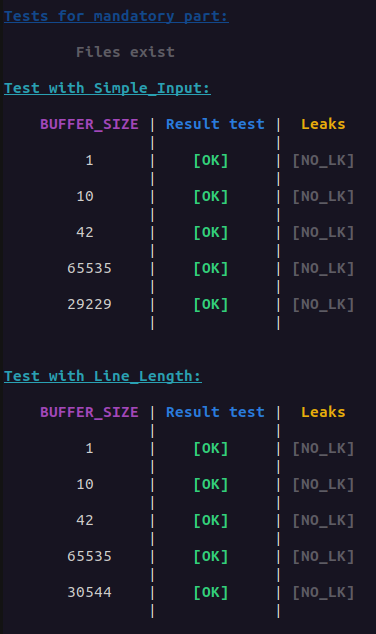

# 42_GNL_tester
the goal of this project is to test your get_next_line function

### Clone this repo
```shell
git clone https://github.com/EthanDelage/42_Get_Next_Line.git GNL_tester
```
### Clone your repo with get_next_line function

## Setup test
* Change the path in grademe.sh at line 11 ```GNL_Path="path_of_your_GNL_repo"```
* Add the following code in get_next_line.h and get_next_line_bonus.h:
```C
#include "ld.h"
```

## Run test
The tests for the bonus part are in progress
Part | Command
--- | :---:
Test the mandatory part | ```bash grademe.sh m```
Test the bonus part | ```bash grademe.sh b```
Test all parts | ```bash grademe.sh```

## Example
<p align="center">
  
</p>
